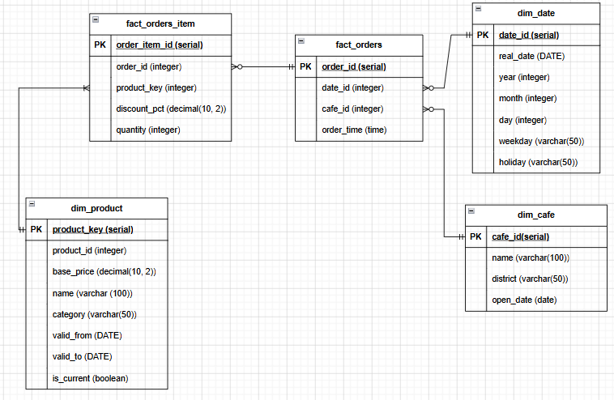
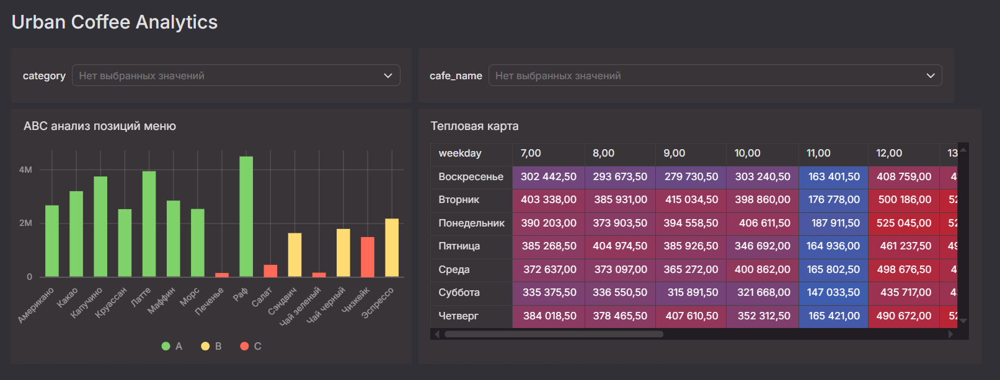

# coffe_shop_analysis_project
Аналитическое решение для сети кофеен: от разрозненных отчётов к единому дашборду с инсайтами.

## Содержание

* **ABC-анализ** — поиск товаров-лидеров и кандидатов на удаление из меню
* **Тепловая карта** — пиковые и мёртвые часы по выручке для каждой точки

Полный список бизнес-целей и функциональных требований — в [requirements.md](requirements.md).

## Модель данных

Схема «Звезда» с двумя фактовыми таблицами. Для хранения исторических цен использован SCD Type 2.



## Аналитические запросы

Все запросы реализованы в виде представлений (VIEW) в базе данных.
Исходный код запросов находится в папке `sql/`.

| Представление | Назначение |
|:---|:---|
| `v_abc_analysis` | ABC-анализ товаров по выручке |
| `v_heatmap` | Данные для тепловой карты (выручка по дням и часам) |


## Дашборд

Две страницы: «ABC-анализ» и «Тепловая карта».



## Что показали данные

* 80% выручки делают пять товаров: Латте, Капучино, Американо, Раф и Сэндвич
* Салат, Печенье и Чай зелёный — кандидаты на удаление из меню
* В центре после 18:00 можно сокращать смену, а в спальном районе — сдвинуть открытие на 09:00

## Запуск
Данные генерируются скриптом `generate_data.py`, схема — в `schema.sql`, представления — в `sql/`.

```bash
PGPASSWORD=$DB_PASSWORD psql -h localhost -U $DB_USER -d urban_coffee -f schema.sql
python3 generate_data.py
PGPASSWORD=$DB_PASSWORD psql -h localhost -U $DB_USER -d urban_coffee -f sql/heatmap.sql  # и остальные VIEW
cd datalens && HC=1 docker compose up -d
```

### Примечание
DB_USER и DB_PASSWORD - переменные окружения

