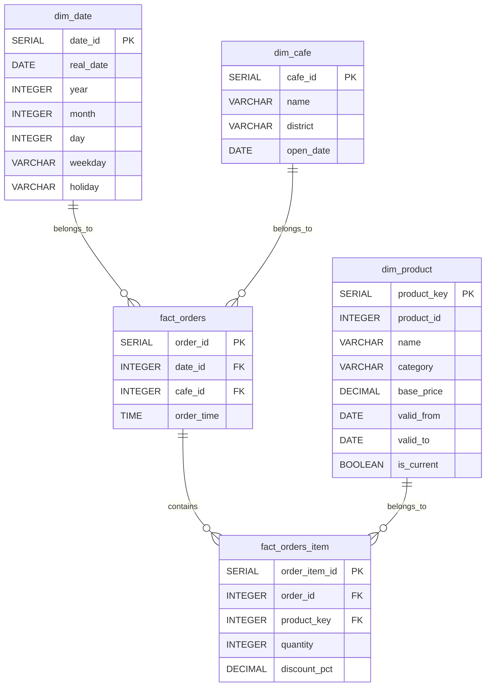

# coffe_shop_analysis_project

```mermaid
erDiagram
    fact_orders ||--o{ fact_orders_item : contains
    dim_date ||--o{ fact_orders : belongs_to
    dim_cafe ||--o{ fact_orders : belongs_to
    dim_product ||--o{ fact_orders_item : belongs_to

    fact_orders {
        SERIAL order_id PK
        INTEGER date_id FK
        INTEGER cafe_id FK
        TIME order_time
    }

    fact_orders_item {
        SERIAL order_item_id PK
        INTEGER order_id FK
        INTEGER product_key FK
        INTEGER quantity
        DECIMAL discount_pct
    }

    dim_date {
        SERIAL date_id PK
        DATE real_date
        INTEGER year
        INTEGER month
        INTEGER day
        VARCHAR weekday
        VARCHAR holiday
    }

    dim_product {
        SERIAL product_key PK
        INTEGER product_id
        VARCHAR name
        VARCHAR category
        DECIMAL base_price
        DATE valid_from
        DATE valid_to
        BOOLEAN is_current
    }

    dim_cafe {
        SERIAL cafe_id PK
        VARCHAR name
        VARCHAR district
        DATE open_date
    }
```